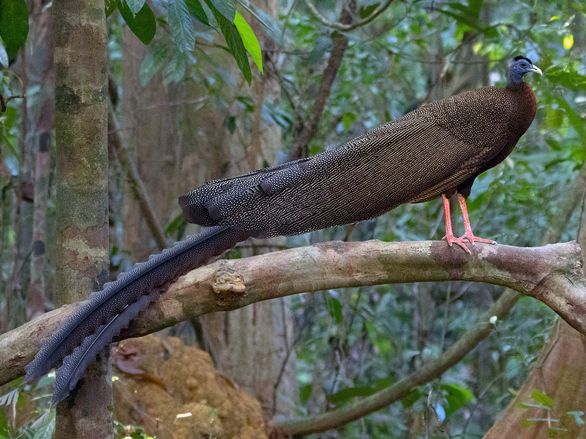
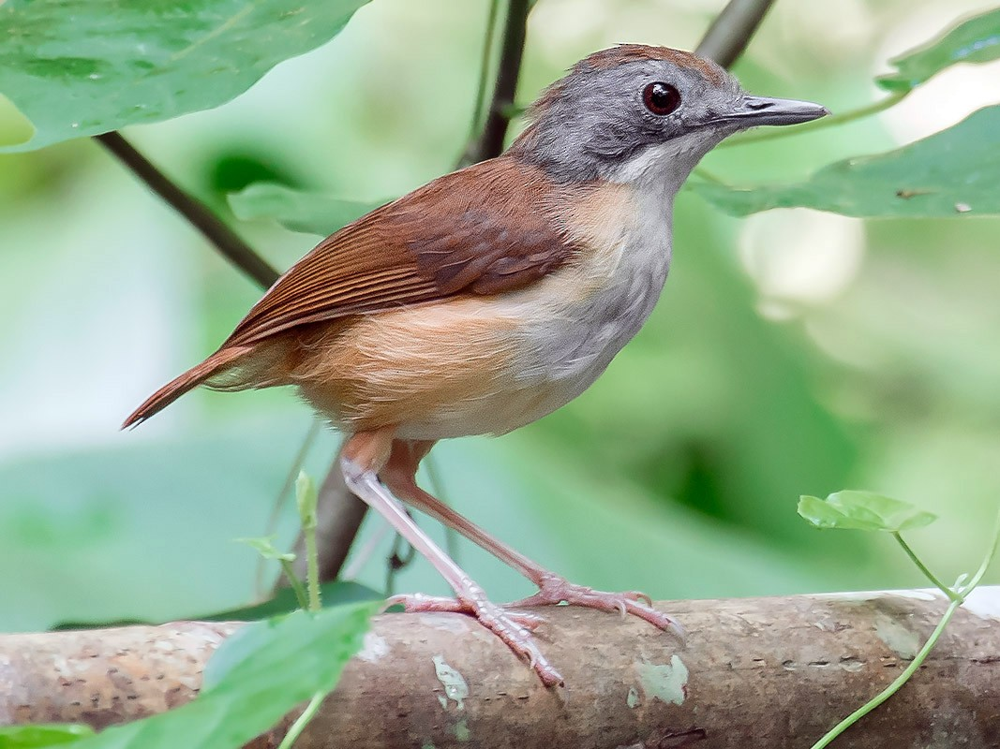
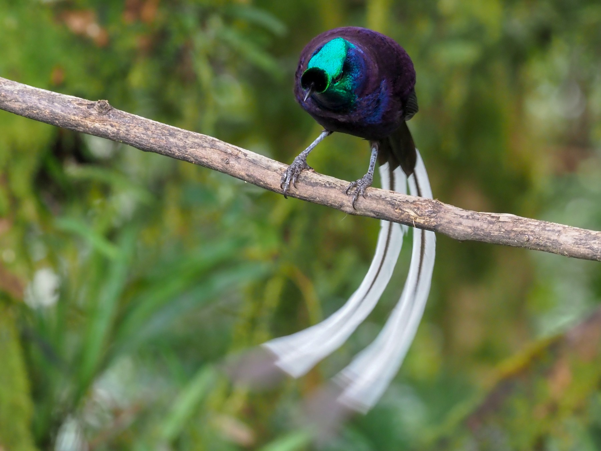

\newpage
\tableofcontents 
\newpage
\listoftables 
\listoffigures 
\newpage

```{r setup, include=FALSE}

#Get working directory
getwd()

# Load packages
library(tidyverse)
library(GGally)
library(car)
library(knitr)
library(psych)
library(agricolae)
library(cowplot)
library(summarytools)

# Set your ggplot theme
ourtheme <- theme_bw(base_size = 12) +
  theme(axis.text = element_text(color = "black"),
        legend.position = "right")
theme_set(ourtheme)

# Load datasets
birds <- read.csv("../Data/Raw/avian_ssd_jan07.csv")

# Set digit notation
options(scipen = 10)
```

# Rationale and Research Questions

According to the study from which this data was extracted, avian body size and the evolution of birds over time is a subject matter that has generated much debate. Generally, there is agreement around the idea that body size of bird species relates to other characteristics, but the role of evolution continues to be disputed. This project intends to explore the correlation between tail length and other characteristics in our data. 

First, we ask the question if female tail length predicts clutch size. Tail length has a significant impact on control and agility (Evans 1999). Longer tails increase crash risk as well as reduce the ability to maneuver (Evans 1999). We believe that tail length may have an overall negative impact on clutch size, as birds with longer tail lengths may be less efficient at collecting food for their young. 

Second, we will explore interactions between male tail length and methods of display, mating system, and resource sharing systems. As stated above, tail length likely has a negative impact on navigation and collecting food, but male tail length has a positive impact on sexual display for many species. Physical characteristics of males are evaluated by females in search of a mate, but the importance of tail length may vary greatly by species. 



# Dataset Information

Our dataset consists of ornithological data that was collected starting in 2005 and was last updated in January of 2007. Data for this collection come from regions that include:

* Western Palearctic
* Neararctic
* Africa
* Australia
* New Zealand
* Antarctica

The complete dataset (represented by the object **`birds`**) includes 41 variables and represents 125 families. According to the metadata, the majority of this information was gathered from ornithological handbooks, with some data obtained from personal communications with authors who published information on species bird groups. More information on the sources used can be found at: https://esapubs.org/archive/ecol/E088/096/metadata.htm (also in /Data/Raw in the .tex file) 

\newpage

# Exploration of Raw Data 

```{r explore_the_full_data1, include=FALSE}
# dimensions
dim(birds)
# column names
colnames(birds)
# summary of columns
summary(birds)
```

View dimensions, column names, variable type, and head of each column:

```{r explore_the_full_data2, echo = FALSE}
# Data structure:
str(birds)
```


\newpage

# Data Wrangling
```{r wrangle_the_data, warning = FALSE, message = FALSE}
# make sure family column is named correctly
colnames(birds)[1] <- "Family"

# Convert -999 to NAs and add genus column
birds <- birds %>%
  na_if(., -999) %>%
  separate(Species_name, 
           sep = " ", 
           into = c("Genus", "Sp"), 
           remove = FALSE)

# Subset to columns we are interested in
birds.subset <- birds %>%
  select(Family, Species_name, Genus, F_mass, M_mass, 
         F_tail, M_tail, Clutch_size, Mating_System, 
         Display, Resource)

# Group male tail length by mating system to graph later
birds.mating.tail <- birds.subset %>%
  group_by(Mating_System) %>%
  summarise(M_tail = mean(M_tail, na.rm = TRUE))

# Set categorical variables as factors
birds.subset$Family <- as.factor(birds.subset$Family)
birds.subset$Mating_System <- as.factor(birds.subset$Mating_System)
birds.subset$Display <- as.factor(birds.subset$Display)
birds.subset$Resource <- as.factor(birds.subset$Resource)

# Write the csv file into our Processed data folder
write.csv(birds.subset, file = "../Data/Processed/birds_subset.csv")
```

```{r exploratory_family_wrangle, eval = FALSE, echo = FALSE}
# Wrangle by family just to see what the results look like

# This function allows calculation of mode for categorical variables
Mode <- function(x) {
  ux <- unique(x) 
  ux[which.max(tabulate(match(x, ux)))]
}

# Group by family, average by mean or mode
birds.family <- birds.subset %>%
  group_by(Family) %>% 
  summarise(F_mass = mean(F_mass, na.rm = TRUE),
            M_mass = mean(M_mass, na.rm = TRUE),
            F_tail = mean(F_tail, na.rm = TRUE),
            M_tail = mean(M_tail, na.rm = TRUE),
            Clutch_size = mean(Clutch_size, na.rm = TRUE),
            Common_Mating_System = Mode(Mating_System),
            Common_Display = Mode(Display),
            Common_Resource = Mode(Resource)) %>%
  filter(!is.na(Clutch_size), !is.na(F_tail), 
         !is.na(F_mass), !is.na(M_tail))

# View relationships between variables
ggpairs(birds.family, columns = 2:9)

# Write the file into CSV
write.csv(birds.family, file = "../Data/Processed/birds_family.csv")
```

\newpage
# Exploration of Processed Data

```{r explore_processed_dataset, include = FALSE}
# Look at the data again, make sure it looks good
dim(birds.subset)
summary(birds.subset)
str(birds.subset)
```

```{r gg exploration, echo = FALSE, warning = FALSE, message = FALSE, fig.width = 9, fig.height = 9}
# View variable distributions and relationships
gg.birds.subset <- subset(birds.subset, select = -c(Family, Species_name, Genus))
ggpairs(gg.birds.subset)
```

\newpage
```{r summary tables, echo = FALSE}
# Create summary table (using "psych" package)
birds_summary <- describe(birds.subset[,c("F_mass", "M_mass", "F_tail", "M_tail", "Clutch_size")], fast = T)

kable(birds_summary, caption = "Summary Statistics for Continuous Variables")

# Then create summary tables of categorical variables
birds.subset %>%
  select(Mating_System) %>%
  freq(cumul = FALSE) %>%
  tb() %>%
  kable(caption = "Summary Statistics for Mating System")

birds.subset %>%
  select(Display) %>%
  freq(cumul = FALSE) %>%
  tb() %>%
  kable(caption = "Summary Statistics for Display System")

birds.subset %>%
  select(Resource) %>%
  freq(cumul = FALSE) %>%
  tb() %>%
  kable(caption = "Summary Statistics for Resource System")

```


```{r exploratory_plots, include = FALSE, fig.cap = "Exploratory Plot of Clutch Size by Family"}
# Boxplot of families vs clutch size
ggplot(birds.subset) +
  geom_boxplot(aes(x = Family, y = Clutch_size)) +
  theme(axis.text.x = element_blank(), 
        axis.ticks.x = element_blank()) +
  ylab("Clutch Size")
```


\newpage

### Female versus Male Tail Length

As part of our exploration, we ran a regression to assess how correlated male and female tail lengths are.

```{r tail_regression, echo = FALSE, warning = FALSE, message = FALSE}
# Run regression to compare male and female tail length
lm.tail <- lm(data = birds.subset, M_tail ~ F_tail)
# Check summary
summary(lm.tail) # highly correlated
```

The answer is yes, they are correlated (p < 0.001, Adjusted R^2 = 0.924).

\newpage

Below, although male and female tail lengths are highly correlated, some male tail lengths are unusually longer in comparison with female tail lengths. These species may be ones where males have adapted longer tails via sexual selection. 


```{r r exploratory_plots_3, echo = FALSE, message = FALSE, warning = FALSE, fig.cap = "The Relationship between Female and Male Tail Length"}
ggplot(birds.subset, aes(x = F_tail, y = M_tail)) +
  geom_point() +
  geom_smooth(method = "lm", se = F) +
  labs(x = "Female Tail Length (mm)", y = "Male Tail Length (mm)")
```

\newpage

To visualize the relationship between male and female tail length another way, here are the distributions of tail length sorted by family and divided by sex. 


```{r r exploratory_plots_1, echo = FALSE, warning = FALSE, fig.cap = "Exploratory Plots of Tail Length by Sex and Family"}
# Boxplot of families vs female tail
plot.fam.ftail <- ggplot(birds.subset) +
  geom_boxplot(aes(x = Family, y = F_tail)) +
  theme(axis.text.x = element_blank(), 
        axis.ticks.x = element_blank()) +
  ylab("Female Tail Length (mm)") +
  scale_y_continuous(limits = c(NA, 800))

# Boxplot of families vs male tail
plot.fam.mtail <- ggplot(birds.subset) +
  geom_boxplot(aes(x = Family, y = M_tail)) +
  theme(axis.text.x = element_blank(), 
        axis.ticks.x = element_blank()) +
  ylab("Male Tail Length (mm)") +
  scale_y_continuous(limits = c(NA, 800))

plot_grid(plot.fam.ftail, plot.fam.mtail)
# In some families, males have longer tails and/or a broader range of tail lengths. The tail lengths in these families are probably more impacted by sexual selection compared with other families.
```

```{r r exploratory_plots_4, include = FALSE, warning = FALSE, fig.cap = "Male Tail Length by Mating System"}
# Exploratory plot:
# Boxplot of mating system vs male tail length
ggplot(birds.subset) +
  geom_boxplot(aes(x = Mating_System, y = M_tail)) +
  labs(y = "Male Tail Length (mm)", x = "Mating System")
# MS #5 appears higher and #1 appears lower (keeping in mind #2 likely has the most variance)
```

```{r r exploratory_plots_5, include = FALSE, warning = FALSE, fig.cap = "Male Tail Length by Display System"}
# Exploratory plot:
# Boxplot of display system vs male tail length
ggplot(birds.subset) +
  geom_boxplot(aes(x = Display, y = M_tail)) +
  labs(y = "Male Tail Length (mm)")
# Display #5 appears higher than the others
```

```{r exploratory_plots_6, include = FALSE, fig.cap = "Male Tail Length by Resource System"}
# Exploratory plot:
# Boxplot of resource system vs male tail length
ggplot(birds.subset) +
  geom_boxplot(aes(x = Resource, y = M_tail)) +
  labs(y = "Male Tail Length (mm)")
# Resource #1 may be higher, but not much difference
```

\newpage

# Analysis

To test our hypotheses using our subset data `birds.subset`, we will conduct a linear regression and an analysis of variance (ANOVA). Our first research question will be answered using a linear regression, while our second will be addressed with an ANOVA. Results will be stated in words and supplemented using graphing visualizations. 


## Question 1: Does female tail length predict clutch size?
$H_0$ : There is no significant difference between female tail length and clutch size.

$H_A$ : There is a significant difference between female tail length and clutch size.

```{r question_1_pre-analysis, include = FALSE}
# First, explore whether female mass and female tail length are correlated. If they are highly correlated, then effects of tail length could be explained by mass.
summary(with(birds.subset, lm(F_tail ~ F_mass)))
# They are, though R2 is fairly low so mass doesn't explain most variation in tail length.
```

Prior to conducting this analysis, it was identified that there is a strong correlation between female mass and female tail length. This makes sense: in general, bigger birds will have longer tails. We therefore included the mass variable in our model, in order to measure the effect of tail on clutch size while controlling for the effect of mass. 

### Model

```{r question_1, warning = FALSE, message = FALSE, echo = FALSE}

# Do female mass and tail size predict clutch size?
lm.tailmass <- with(birds.subset, lm(Clutch_size ~ F_tail * F_mass))
summary(lm.tailmass)
# Yes! Both mass and tail and their interaction are significant.
# p < 0.001, R2 = 0.022
```

Yes, both mass and tail and their interaction are significant (p < 0.001). We can reject the null hypothesis and conclude that mass and tail predict clutch size.

### Assumptions

Check for multicollinearity. A VIF score below 5 indicates an acceptable level of multicollinearity:

```{r q-1_vif, warning = FALSE, message = FALSE, echo = FALSE}
vif(lm.tailmass)
# A VIF below 5 indicates acceptable level of multicollinearity
```

### Residuals

Next, view residual plots:

```{r q-1_residuals, echo = FALSE, warning = FALSE, message= FALSE, fig.cap = "Residual Plots for Question 1"}
# Change settings to view all residual plots at once
par(mfrow=c(2,2))
# View residuals 
plot(lm.tailmass)

# Change settings back
par(mfrow=c(1,1))
```

\newpage

### Clutch Size by Tail Length

Below: clutch size declines with increasing female tail length.

```{r q-1_plot_main, echo = FALSE, warning = FALSE, message = FALSE, fig.cap = "Female Tail Length vs Clutch Size"}
ggplot(subset(birds.subset, F_mass<5000), aes(x = F_tail, y = Clutch_size)) +
  geom_point(aes(color = F_mass), alpha = 0.8) +
  geom_smooth(method = "lm", se = F, color = "seagreen4") +
  labs(x = "Female Tail Length (mm)", y = "Clutch Size", color = "Female Mass (g)") +
  scale_color_viridis_c() +
  scale_x_continuous(limits = c(NA,450)) +
  scale_y_continuous(limits = c(NA,15))
```

``` {r q-1_plot_control, include = FALSE, fig.cap = "Female Mass vs Clutch Size"}
# Plot the results
ggplot(birds.subset[], aes(x = F_mass, y = Clutch_size)) +
  geom_point(aes(color = F_tail), alpha = 1) +
  geom_smooth(method = "lm", se = F, color = "seagreen4") +
  labs(x = "Female Mass (g)", y = "Clutch Size", color = "Female Tail \nLength (mm)") +
  scale_x_continuous(limits = c(0, 12000)) +
  scale_color_viridis_c()
```

\newpage

## Question 2: Does male tail length relate to mating approaches?
$H_0$ : Mating system and display behavior do not predict tail size.

$H_A$ : Mating system and/or display behavior do predict tail size.

### Assumptions

First, test for normality and equal variance:

```{r question_2_part_1, echo = FALSE, warning = FALSE}
#test for normality
shapiro.test(birds.subset$M_tail) 
# Not normally distributed

qqnorm(birds.subset$M_tail); qqline(birds.subset$M_tail)

# test for equal variance
with(birds.subset, bartlett.test(M_tail ~ Mating_System))
with(birds.subset, bartlett.test(M_tail ~ Display))
# All significant; the variances are not equal
```

A p-value below the 0.05 threshold from the Bartlett Test indicates that the variances differ significantly for both Mating System and Display System.
   

### Model Reduction

Next, run the model: 

```{r question_2_part_2, warning = FALSE}
mating.anova <- aov(data = birds.subset, M_tail ~ Mating_System * Display * Resource)
summary(mating.anova)
```


Because not everything was significant, we used a nested model approach to reduce the model until all components were significant. 


```{r question_2_part_3, include = FALSE}
# Reduce the model to achieve significance
# Remove 3-way interaction
mating.anova.1 <- update(mating.anova, .~.-Mating_System:Display:Resource) 
summary(mating.anova.1)

# Remove Display:Resource
mating.anova.2 <- update(mating.anova.1, .~.-Display:Resource) 
summary(mating.anova.2)

# Remove Mating_System:Resource
mating.anova.3 <- update(mating.anova.2, .~.-Mating_System:Resource) 
summary(mating.anova.3)

# Remove Resource
mating.anova.4 <- update(mating.anova.3, .~.-Resource) 
summary(mating.anova.4)
# Everything is significant.
# Not possible to run an AIC comparison because 
#the models do not contain the same number of observations.
# Go with mating.anova.4
```

\newpage

Here is the final model:

```{r problem_2_final_model, warning = FALSE, message = FALSE}
mating.anova.final <- aov(data = birds.subset, M_tail ~ Mating_System * Display)
summary(mating.anova.final)
``` 

The interaction between mating system and display system is significant (p < 0.001). We can reject the null hypothesis and accept that mating system and display system predict male tail length.

```{r tukey, include = FALSE, warning = FALSE, message = FALSE}
#Grouping with Tukey HSD
anova.group <- HSD.test(mating.anova.4, "M_tail", group = TRUE)
anova.group
``` 


### Residuals

```{r q-2 residual, echo = FALSE, warning = FALSE, message = FALSE, fig.cap = "Residual Plots for Question 2"}
# Change settings to view all residual plots at once
par(mfrow=c(2,2))
# View residuals 
plot(mating.anova.4)
# Change settings back
par(mfrow=c(1,1))
```

\newpage

### Tail Length by Mating and Display Systems

Below, average male tail length by mating system and display system.

```{r q-2-plots, echo = FALSE, warning = FALSE, fig.cap = "Male Tail Length vs Mating Tactics", fig.width = 7}
# Graph results
ggplot(data = subset(subset(birds.subset, !is.na(Mating_System)), !is.na(Display)), aes(x = Mating_System, y = M_tail, color = Display)) +
  geom_boxplot() +
  labs(x = "Mating System", y = "Average Male Tail Length (mm)") +
  scale_x_discrete(labels = c("Polyandry", "Monogamy", "Mostly Monogamy", "Mostly Polygyny", "Promiscuous")) +
  scale_color_discrete(labels = c("Ground Displays", "Mostly Ground", "Ground & Aerial", "Aerial, Non-Acrobatic", "Aerial, Acrobatic")) +
  theme(axis.text.x = element_text(angle=45, hjust = 1))

```

\newpage

Below, the same results as the previous page but with the mating system and display system swapped. 
```{r q-2-plots2, echo = FALSE, warning = FALSE, fig.cap = "Male Tail Length vs Mating Tactics", fig.width = 7}
# Graph results
ggplot(data = subset(subset(birds.subset, !is.na(Mating_System)), !is.na(Display)), aes(x = Display, y = M_tail, color = Mating_System)) +
  geom_boxplot() +
  labs(x = "Display System", y = "Average Male Tail Length (mm)", color = "Mating System") +
  scale_x_discrete(labels = c("Ground Displays", "Mostly Ground", "Ground & Aerial", "Aerial, Non-Acrobatic", "Aerial, Acrobatic")) +
  scale_color_discrete(labels = c("Polyandry", "Monogamy", "Mostly Monogamy", "Mostly Polygyny", "Promiscuous")) +
  theme(axis.text.x = element_text(angle=45, hjust =1))

```

\newpage

# Summary and Conclusions


## Part 1

The interaction between female mass and tail size predicts clutch size (p < 0.001, n = 1642, R^2^ = 0.022). In general, clutch size appears to decrease with increasing tail length, but this effect is mediated by overall body size as expressed by mass. 

However, it is important to note the limitations of our model. Our model does not explain much of the variance, as seen from our low R^2^ value. We can also see that the residual plots are quite clumped together in each plot at a different location. More explanatory variables should be used to determine the impact of female mass and tail size on clutch size. 

Our finding supports the hypothesis that birds with longer tails may expend more resources collecting food because of their reduced agility. Therefore, they may have adapted to produce fewer eggs because they cannot care for as many chicks as more agile birds. More research is needed to substantiate this hypothesis as well as to better understand how overall body size mediates the effect. 




\newpage

## Part 2

Mating system and display system interact to predict tail length (n = 476, p < 0.001), supporting our hypothesis. In general, mostly polygynous and promiscuous birds with mostly ground displays appear to have the longest tails. Among monogamous and mostly monogamous birds, those with aerial displays have the longest tails.

This said, it should be noted that tail length is not normally distributed, and could be transformed in future analysis to meet the normality assumption. Groups in this analysis also do not have equal variance. For example, in Mating System, most birds are identified as monogamous (2), leading to a skew in the data, not because of lack of samples but rather lack of diversity in this category. Similarly to part one, we find clumps of data points in the residual plots, but in this case they seem to reflect the unequal grouping of variables used within this analysis. There are vertical groups that are distinguishable across all plots, which is something that should be explored in the future, as an attempt to correct this or eliminate its overall impact on the data. 

Our result indicates that birds vary in tail length according to both their mating system and their display system. This finding is not surprising considering that male birds with particularly long tails are known to use them in courtship displays, so species of birds have developed varied tail lengths alongside specific mating behaviors. We chose not to control for overall mass in this model because increasingly complex statistical analyses are outside of the scope covered in this course, but the lack of control is a definitive limitation of this finding: some patterns of mating system and display predicting tail length may be a result of overall size rather than tail length specifically. More research and analyses are needed. 



\newpage

# References

* Chotjuckdikul, N. 2017. Short-tailed Babbler: *Pellorneum malaccense.* eBird. https://ebird.org/species/shtbab1

* Evans, M.R. 1999. The consequences of flight for the evolution of tail ornaments in birds. In: Adams, N.J. & Slotow, R.H. (eds) *Proc. 22 Int. Ornithol. Congr.,* Durban: 1823-1843. Johannesburg: BirdLife South Africa.

* Jearwattanakanok, A. 2019. Great Argus: *Argusianus argus.* eBird. https://ebird.org/species/grearg1

* Lislevand, T., Figuerola, J., and Székely, T. 2007. Avian body sizes in relation to fecundity, mating system, display behavior, and resource sharing. *Ecology* 88:1605.

* Lorenz, S. 2019. Ribbon-tailed Astrapia: *Astrapia mayeri.* eBird. https://ebird.org/species/ritast1

